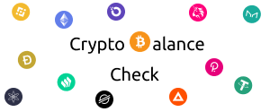

# Crypto Balance Check Slack Bot
[](https://ko-fi.com/X8X71S1S7)

<p align="center">
    
</p>


Crypto Balance Check is a slack integration that will send periodic messages to inform users of their:
- positions by exchange
- aggregated positions
- total position value (currently in CAD)


## Requirements:
- Heroku account
- Heroku CLI
- git 
- Slack workspace with admin privilege

## Deploying to Heroku
- Create a slack custom integration if you have not already
```bash
git clone git@github.com:zahin-mohammad/crypto-balance-check.git
cd crypto-balance-check
```
- Create a heroku project (skip if its already set up)
```bash
heroku login
heroku create
git push heroku master
```
- Setup Environment Variables:
- These can also be configured on the web client for heroku
```bash
heroku config:set SLACK_WEBHOOK="{slack incoming web hook}" 
heroku config:set BINANCE_API_KEY="{binance api_key}" 
heroku config:set BINANCE_API_SECRET="{binance api_secret}" 
heroku config:set COINBASE_API_KEY="{coinbase api_key}" 
heroku config:set COINBASE_API_SECRET="{coinbase_api_secret}"
```
- Verify that the script works
```bash
heroku run python3 ./__main__.py
```
- Install and configure the scheduler via the CLI
- configure frequency as desired
```bash
heroku addons:create scheduler:standard
heroku addons:open scheduler
# Under Run Command: python3 ./__main__.py
```

## Notes
- The messages are hardcoded to `Zahin`
- Currently, non CAD currencies aren't supported

[comment]: <> (- Setup Firebase)

[comment]: <> (  - Create a firebase project at `https://firebase.google.com/`)

[comment]: <> (  - Create a database)

[comment]: <> (  - Download a private key from `settings -> Service Accounts`)

[comment]: <> (  - Rename this file to `firestore-admin.json`)

[comment]: <> (- Add Firebase Admin Cred to Heroku)

[comment]: <> (  - On the web heroku client, paste in the contents of `firestore-admin.json` into a config var &#40;environment variable&#41; called `firestoreAdmin`)

[comment]: <> (  - Should see a slack message)
